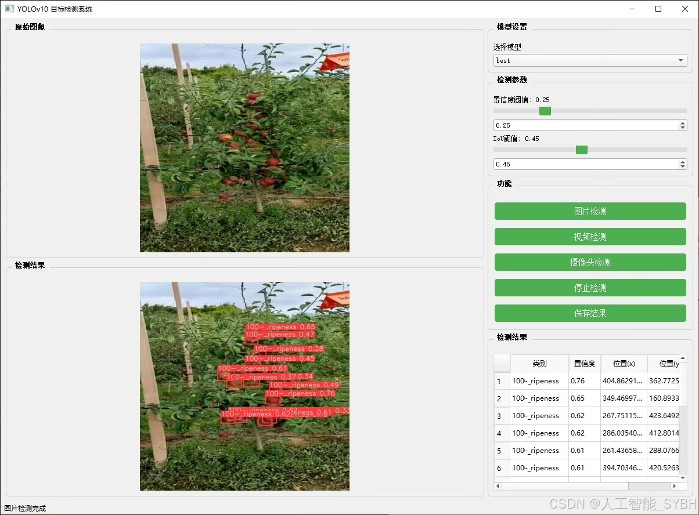
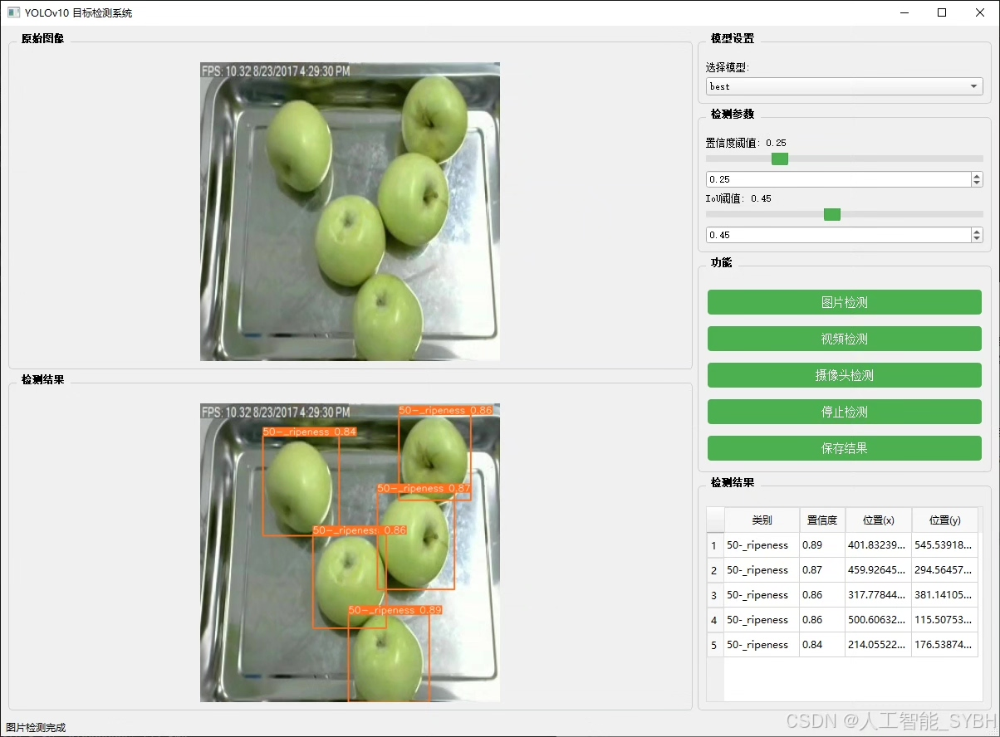
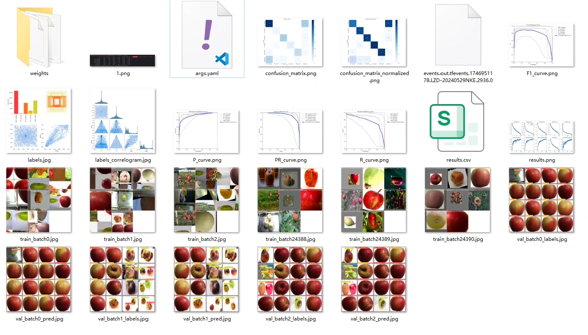
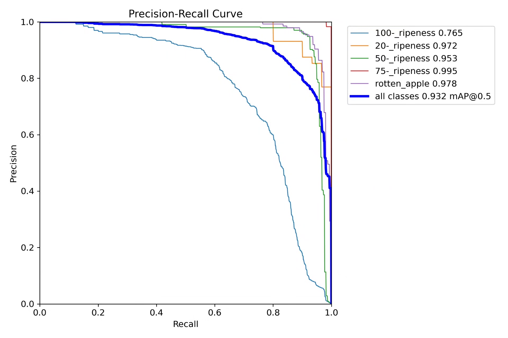
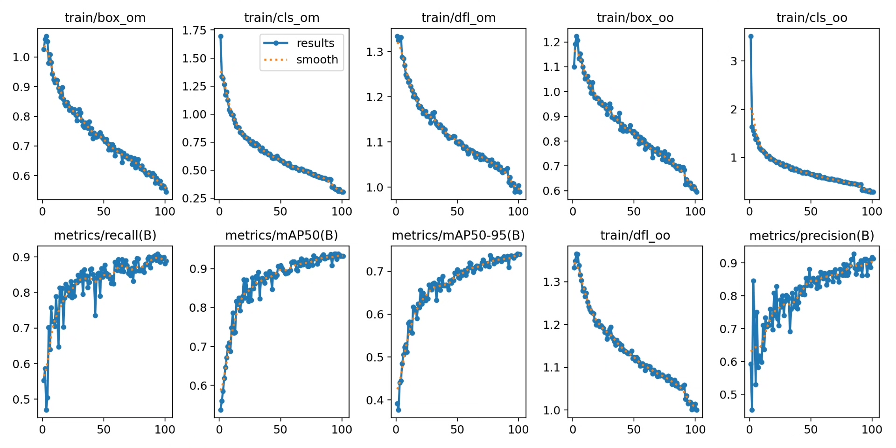
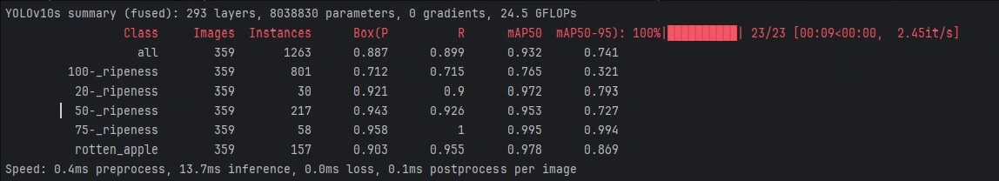
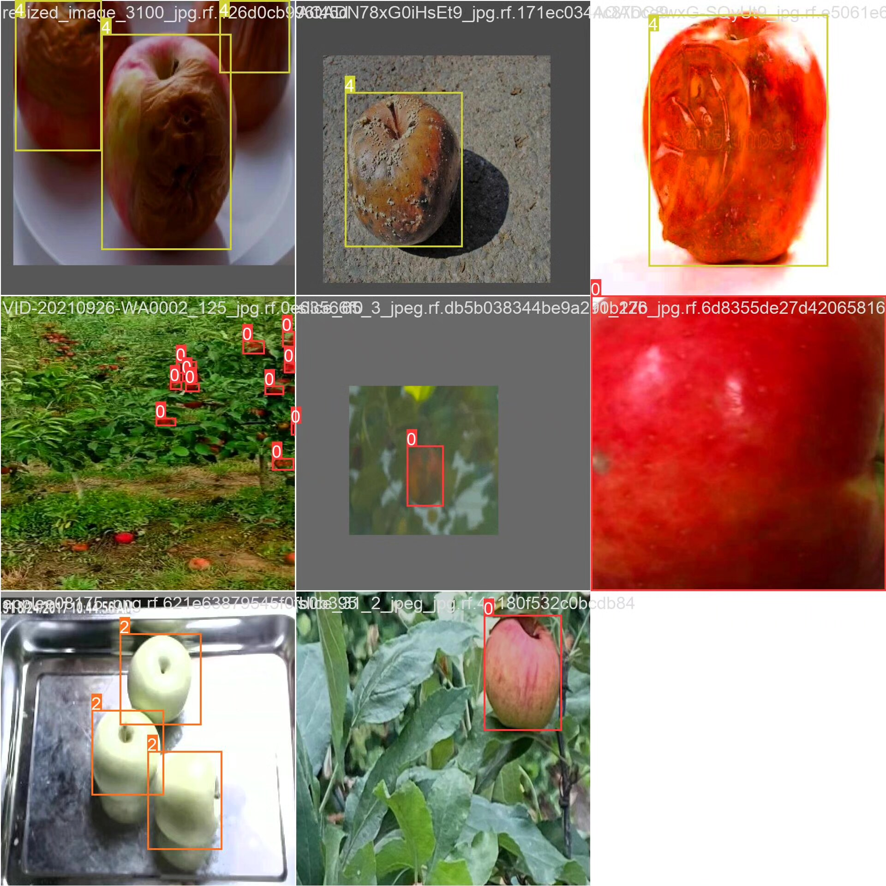
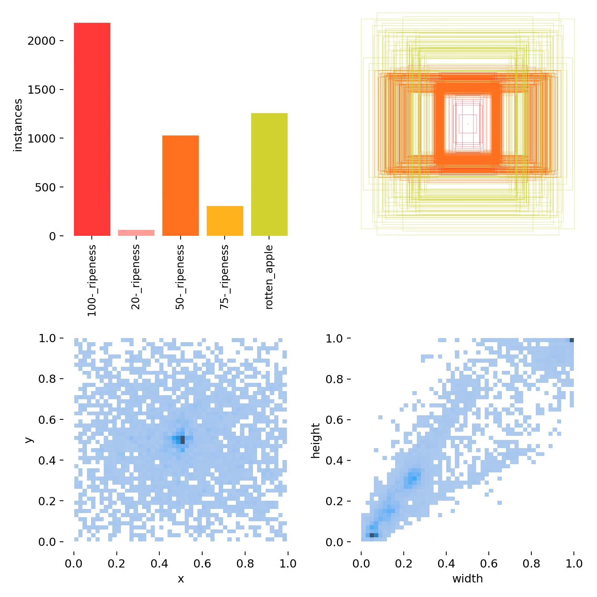

# Based on deep learning YOLOv10 for apple maturity detection system (YOLOv1)

## Body

Based on the YOLOv10 object detection algorithm, this project has developed an automatic apple maturity detection system. It can accurately identify and classify five levels of apple maturity: 20% ripe, 50% ripe, 75% ripe, 100% ripe, and rotten apples. The system uses a dataset containing 2728 labeled images (2144 training images, 359 validation images, and 225 test images) for training and evaluation, achieving precise recognition of apple maturity status. This technology can be applied in agricultural scenarios such as orchard automation management, intelligent picking robots, and fruit quality classification, significantly improving fruit harvesting efficiency and quality control levels. It reduces subjectivity and errors in manual judgments, providing technical support for the intelligent development of modern agriculture.

The company's products have obtained YOLO official commercial license certification.

We provide after-sales service.

After payment, we will provide WeChat ID to answer questions at any time.

Environment configuration: We will provide a tutorial on environment configuration, and WeChat provides Q&A services.

Remote installation service: If you need remote configuration, an additional fee of 69 is required, with all fees refunded if the configuration fails (only the installation fee is refunded for older computers).

Retraining dataset: After setting up the environment, you can train on your own computer. If you need us to retrain, just pay 69 plus computing power fees (2.5 yuan/hour).

Full after-sales service

## Images

## Payment

Here is a pay link on Stripe ( https://buy.stripe.com/3cs8yP7sY87d0vu9AB ). Please contact me lonlonago@foxmail.com after funding $89, and I will send you a complete data files , thank you!

